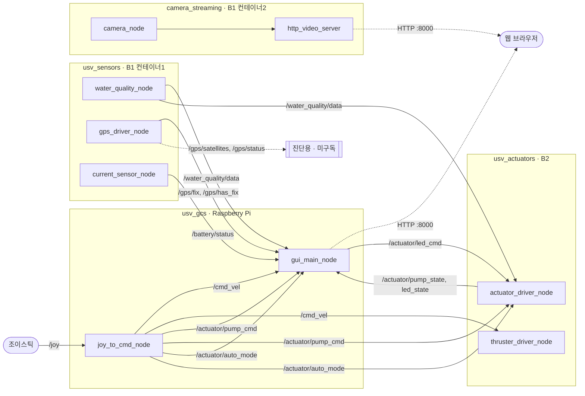

# 🚤 6can_usv_project

ROS 2 Jazzy 기반 USV 프로젝트. 토픽 이름/타입은 아래 **인터페이스 계약**(1항)에 고정되어
있고, 내부 구현은 자유롭게 바꿔도 됩니다. `TODO(B1 담당자):` / `TODO(B2 담당자):` /
`TODO(GCS 담당자):` 로 표시된 부분이 남은 작업입니다.

```bash
grep -rn "TODO(" usv_ws/src
```

---

## ⚙️ 0. 시스템 요구사항

- ROS 2 Jazzy, 세 보드 모두 같은 `ROS_DOMAIN_ID`
- GCS = Raspberry Pi(네이티브), B1/B2 = Arduino UNO Q 2대(Docker 필수, `--privileged -v /dev:/dev`)
- **범위 제외**: `watchdog_node`/heartbeat 패키지, `/cmd_vel_safe`(→ 추진기는 `/cmd_vel` 직접 구독)
- `/gps/satellites`, `/gps/status`는 발행은 하되 GCS는 구독 안 함 (진단용)
- Arduino 스케치(`.ino`) 필요 여부: **필요**(water_quality/gps, sketch 완료) · **불필요**(camera, usv_gcs 전체) · **미정**(B2 추진기/펌프/LED — 하드웨어 미확정)

---

## 🗺️ 1. 아키텍처

| 보드 | 패키지 | 담당 | 실행 |
|---|---|---|---|
| B1 (UNO Q) | `usv_sensors` + `camera_streaming` | 수질·GPS·전류·카메라 | Docker, 컨테이너 2개 — `./start_b1.sh` |
| B2 (UNO Q) | `usv_actuators` | 추진기·펌프·LED | Docker — `./start_actuators.sh` |
| GCS (Raspberry Pi) | `usv_gcs` | GUI·조종 | 네이티브 |

`camera_streaming`이 `usv_sensors`와 별도 컨테이너인 이유: `cv_bridge`/`web_video_server`가
B1의 작은 디스크에서 빌드를 실패시켜서 `opencv-python-headless` + 자체 HTTP 서버로 따로
만들었습니다 (상세: `CAMERA_STREAMING.md`).

```
usv_ws/
├── start_b1.sh, install_b1_autostart.sh   # B1의 두 컨테이너를 한 번에
└── src/
    ├── usv_sensors/       # B1 — water_quality_node, gps_driver_node, current_sensor_node
    ├── camera_streaming/  # B1 — camera_node, http_video_server (별도 컨테이너)
    ├── usv_actuators/     # B2 — thruster_driver_node, actuator_driver_node
    └── usv_gcs/           # GCS — gui_main_node, joy_to_cmd_node
```

### 인터페이스 계약

이름/타입을 바꿔야 하면 **이 표부터 고치고 공유**하세요.

| 토픽 | 타입 | 발행 | 구독 |
|---|---|---|---|
| `/water_quality/data` | `String`(JSON) | `usv_sensors` | `usv_gcs`, `usv_actuators`(자동 제어) |
| `/gps/fix` | `NavSatFix` | `usv_sensors` | `usv_gcs` |
| `/gps/has_fix` | `Bool` | `usv_sensors` | `usv_gcs` |
| `/gps/satellites`, `/gps/status` | `UInt8`, `String` | `usv_sensors` | 미구독(진단용) |
| `/camera/surface/image_raw`, `/camera/underwater/image_raw` | `Image` | `camera_streaming`(B1) | `http_video_server`(같은 컨테이너, B1:8000) → GCS(`camera_host`) |
| `/cmd_vel` | `Twist` | `usv_gcs`(joy_to_cmd_node) | `usv_actuators`, `usv_gcs`(표시) |
| `/battery/status` | `String`(JSON) | `usv_sensors`(current_sensor_node) | `usv_gcs` |
| `/actuator/pump_cmd` | `Bool` | `usv_gcs`(joy_to_cmd_node) | `usv_actuators`, `usv_gcs`(표시) |
| `/actuator/led_cmd` | `ColorRGBA` | `usv_gcs` | `usv_actuators` |
| `/actuator/auto_mode` | `Bool` | `usv_gcs`(joy_to_cmd_node) | `usv_actuators`, `usv_gcs`(표시) |
| `/actuator/pump_state` | `Bool` | `usv_actuators`(실제 적용값) | `usv_gcs` |
| `/actuator/led_state` | `ColorRGBA` | `usv_actuators`(실제 적용값) | `usv_gcs` |

`/battery/status` JSON: `{"thruster1|thruster2|pump_ctrl|sensor_board": {"current_a", "percentage"}}` — 전류 센서 4개 전부 B1에 I2C로 연결.

펌프/LED는 B2가 수질에 따라 자동 제어하되, GCS 수동 명령(`pump_cmd`/`led_cmd`)이 오면 일정
시간 우선합니다. `pump_state`/`led_state`는 그 실제 적용 결과라 `pump_cmd`/`led_cmd`(명령)와
다를 수 있습니다.

### 노드 다이어그램



---

## 🛠️ 2. 공통 준비

```bash
git clone <이 저장소>
cd usv_project/usv_ws
```

전체를 빌드하는 보드는 없습니다 — 컨테이너/노드마다 3항의 `--packages-select`로 자기
패키지만 빌드합니다.

---

## 🚀 3. 보드별 빌드 & 실행

> **B1/B2 둘 다: `install_*_autostart.sh`는 사실상 필수입니다.** 배 위에 올라가면 SSH가 항상
> 되리라는 보장이 없습니다 — 전원이 나갔다 들어오면 사람 개입 없이 코드가 다시 떠야 합니다.
> 설치 후 **SSH가 살아있을 때 한 번 재부팅해서** 아래로 확인하세요:
> ```bash
> sudo reboot
> # 재부팅 후 다시 접속해서
> docker ps                              # 컨테이너가 떠 있는지
> sudo systemctl status usv-sensors.service   # (컨테이너별로 이름 바꿔가며)
> ```
> 재부팅 후에도 안 뜨면 배포 전에 잡아야 할 문제입니다 — 현장에서는 못 고칩니다.

### B1 — `usv_sensors` + `camera_streaming`

```bash
./start_b1.sh                 # 두 컨테이너 순서대로 빌드+실행
./install_b1_autostart.sh     # 부팅 자동 실행 등록 (위 안내 참고)
```

컨테이너 하나만 재시작: `src/usv_sensors/start_sensors.sh`, `src/camera_streaming/start_camera_streaming.sh` 개별 실행.

- 카메라 장치 경로: `camera_streaming/launch/camera_streaming.launch.py`의 `surface_device`/`underwater_device` (기본 `/dev/video2`/`3`)
- `usv_sensors/config/sensors_params.yaml`은 이제 미사용(카메라가 옮겨감)

### B2 — `usv_actuators`

```bash
cd src/usv_actuators
./start_actuators.sh
./install_autostart.sh        # 부팅 자동 실행 등록 (위 안내 참고)
```

```bash
ros2 launch usv_actuators actuators.launch.py max_pwm:=180 bad_below:=35.0 good_above:=55.0
```

### GCS — `usv_gcs` (Docker 불필요)

```bash
sudo apt install ros-jazzy-joy
pip install -r src/usv_gcs/requirements.txt
colcon build --symlink-install --packages-select usv_gcs
source install/setup.bash
ros2 launch usv_gcs gcs.launch.py camera_host:=<B1_IP>
```

`camera_host`는 필수입니다 — 안 넘기면 카메라 스트림이 잘못된 주소를 가리킵니다. 브라우저:
`http://<GCS IP>:8000`.

```bash
ros2 launch usv_gcs gcs.launch.py linear_axis:=1 angular_axis:=0 pump_button:=0 auto_button:=1
```

---

## ✅ 4. 파트별 체크리스트

토픽 이름/타입(1항)만 유지하면 내부 구현은 자유입니다.

### B1 — `usv_sensors`

- [x] `water_quality_node`, `gps_driver_node` — 포팅 완료, 수정 불필요
- [x] `current_sensor_node` — 코드 완료
- [ ] **하드웨어 미확정**: 전류 센서 칩/I2C 주소, `percentage` 환산식 → `sketch.ino`에 반영 필요 (`grep -n "TODO(B1" *.py`)
- 확인: `ros2 topic echo /water_quality/data`, `/gps/status`, `/battery/status`

### B1 — `camera_streaming`

- [x] `camera_node`, `http_video_server` — 코드 완료, 합성 프레임으로 파이프라인 검증됨
- [ ] 실제 USB 카메라 미연결 (`CAMERA_STREAMING.md` 참고)
- 확인: `curl http://<B1 IP>:8000/`, `ros2 topic echo /camera/surface/image_raw --once`

### B2 — `usv_actuators`

- [x] `/cmd_vel` PWM 믹싱, 수질 자동 제어(`water_policy.py`), 수동/자동 우선순위, 상태 발행 — 코드 완료
- [ ] **하드웨어 미확정 — 가장 미완성**: Arduino 스케치 자체가 없음. `set_thruster_pwm`, `set_pump`, `set_actuator_led` RPC 핸들러 구현 필요 (`grep -n "TODO(B2" *.py`)
- [ ] `app.yaml`을 실제 App Lab 앱 이름에 맞춰 확인
- 확인: `ros2 topic pub /cmd_vel geometry_msgs/msg/Twist "{linear: {x: 0.5}}"`

### GCS — `usv_gcs`

- [x] `joy_to_cmd_node`, `gui_main_node`, 대시보드 — 배선/기능 완료
- [ ] 실제 조이스틱 축/버튼 번호 확인 → `linear_axis`/`angular_axis`/`pump_button`/`auto_button` 인자로 반영 (`ros2 topic echo /joy`)
- [ ] `BATTERY_WARNING_PCT`(20%) — 배터리 사양 확정되면 조정
- [ ] (선택) 미니맵용 `google_maps_api_key` — 안 넣으면 정적 이미지로 폴백
- 확인: 대시보드(`http://<GCS IP>:8000`)에서 실시간 값·펌프/LED 상태·카메라 스트림 확인

### 알려진 미정리 항목 (동작엔 지장 없음)

- `usv_sensors/camera_node.py`, `config/sensors_params.yaml` — 미사용 코드(카메라가 `camera_streaming`으로 이동), 팀원 작업 충돌 방지로 남겨둠
- `usv_sensors/Dockerfile`의 `cv_bridge` 의존성 — 위와 같은 이유로 미제거

---

## ✅ 5. 설계 결정

- `watchdog_node` 없음, 추진기는 `/cmd_vel` 직접 구독 (0항)
- `/gps/satellites`/`/gps/status`는 발행만, GCS 미구독 (0항)
- 커스텀 msg(`usv_interfaces`) 없음 — 전부 표준 타입(`std_msgs`/`sensor_msgs`/`geometry_msgs`)

---

## 🐳 6. Docker 참고

| 파일 | 역할 |
|---|---|
| `Dockerfile` | `ros:jazzy-ros-base` + pip 의존성 + `colcon build --packages-select <pkg>` |
| `app.yaml`, `sketch/` (usv_sensors, usv_actuators만) | Arduino App Lab 앱 / MCU 스케치 |
| `start_*.sh` | 이미지 빌드(최초 1회) → 컨테이너 실행 |
| `systemd/*.service` + `install_autostart.sh` | 부팅 자동 실행 |

`camera_streaming`은 MCU/Arduino App Lab과 무관합니다 — USB 카메라를 Linux에서 직접 잡으므로 `sketch/`, RouterBridge 대기 단계가 없습니다.
